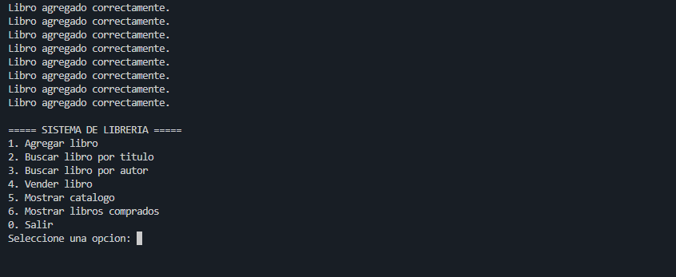
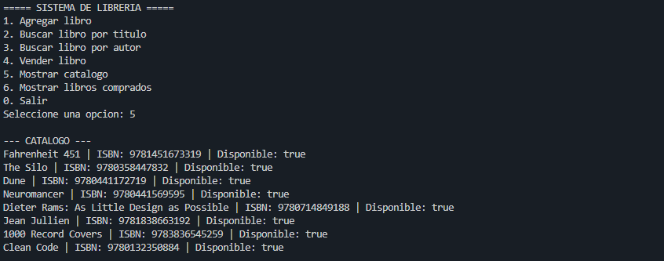
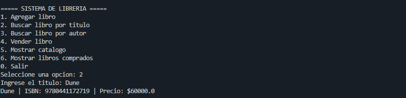
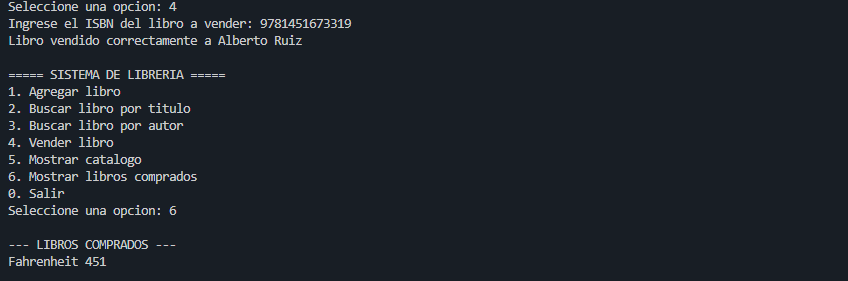

# Laboratorio #1 - Sistema de Gestión de una Librería

**Integrantes:**  
- Alberto Ruiz Ospina  
- Yilbert Montoya Bernal  

**Asignatura:** Programación Avanzada - UNIR  
**Fecha:** 31 de agosto de 2026

---

## 1. Introducción

El trabajo consistió en desarrollar en Java un sistema de gestión para una librería aplicando conceptos de programación orientada a objetos. La aplicación permite administrar libros, autores y clientes, además de realizar búsquedas y ventas desde la terminal.

## 2. Análisis y diseño

A partir de los requisitos se identificaron las clases principales:

- `Libro`
- `LibroTexto`
- `Novela`
- `Autor`
- `Cliente`
- `Libreria`

`Libro` se definió como clase base, mientras que `LibroTexto` y `Novela` heredan de ella. También se establecieron relaciones entre libros y autores, clientes y libros comprados, y la librería con su "catálogo".

## 3. Clase Libro

Contiene los atributos comunes:

- título
- ISBN
- precio
- año de publicación
- disponibilidad
- lista de autores

Los atributos se declararon como privados y se accede a ellos mediante métodos, aplicando encapsulación.

## 4. Herencia

Se implementaron dos clases derivadas:

- `LibroTexto`, que agrega el atributo `nivelEducativo`.
- `Novela`, que agrega el atributo `genero`.

## 5. Clase Autor

La clase `Autor` almacena:

- nombre
- nacionalidad
- lista de libros escritos

Se utilizó `ArrayList<Libro>` para representar que un autor puede estar asociado con varios libros.

## 6. Clase Cliente

La clase `Cliente` contiene:

- nombre
- ID
- lista de libros comprados

La lista de compras también se implementó con `ArrayList<Libro>`.

## 7. Clase Libreria

La clase `Libreria` administra el catálogo y contiene la lógica principal del sistema.

Sus operaciones principales son:

- agregar un libro
- buscar por título
- buscar por autor
- vender un libro
- mostrar el catálogo

Al agregar un libro se verifica que no exista otro con el mismo ISBN (para simplificar las cosas). En una venta se comprueba que el libro exista y esté disponible; después se agrega a la lista del cliente y su disponibilidad cambia a `false` (se puede modificar esto a futuro para mantener la uniformidad en el idioma en el que el usuario interactua con el programa).

## 8. Datos de prueba

Se utilizaron varios libros de interés personal:

- Fahrenheit 451
- The Silo
- Dune
- Neuromancer
- Dieter Rams: As Little Design as Possible
- Jean Jullien
- 1000 Record Covers
- Clean Code

Estos datos permitieron probar objetos de tipo `Libro`, `Novela` y `LibroTexto`.

## 9. Interfaz de consola

La clase `Main` utiliza `Scanner` para permitir que el usuario pruebe el sistema desde la terminal sin editar el código.

El menú permite:

1. Agregar libro.
2. Buscar libro por título.
3. Buscar libro por autor.
4. Vender libro.
5. Mostrar catálogo.
6. Mostrar libros comprados.
0. Salir.

Al agregar un libro, el usuario puede elegir entre libro general, novela o libro de texto e ingresar también los datos del autor.

## 10. Conceptos de POO utilizados

Durante el desarrollo de la aplicación se aplicaron los siguientes conceptos de manera básica:

- **Encapsulación:** atributos privados y métodos de acceso.
- **Herencia:** `LibroTexto` y `Novela` heredan de `Libro`.
- **Polimorfismo:** una referencia de tipo `Libro` puede contener objetos de sus clases derivadas.
- **Asociación:** relaciones entre autores, libros, clientes y librería.
- **Colecciones:** uso de `ArrayList` para almacenar múltiples objetos.

## 11. Pruebas y errores encontrados

El proyecto se compiló usando el encoding UTF-8 para permitir el caracter "ñ" y que la clase determinada no tuviera un significado distinto en el español.

Precisamente, durante el desarrollo apareció un problema de codificación con el caracter `ñ` en nombres de variables. Se solucionó compilando en UTF-8.

Las pruebas confirmaron que el sistema puede agregar, buscar y vender libros correctamente, además de actualizar su disponibilidad y registrar las compras de un cliente.

## 12. Conclusión

La realización de este proyecto nos permitió desarrollar un sistema funcional de gestión de librería aplicando los principios básicos de programación orientada a objetos en Java, además de unos cuantos un poco más complejos para hacer del programa algo más interactivo. Precisamente, el diseño previo de clases y relaciones facilitó la implementación y permitió construir una aplicación que puede probarse directamente desde la terminal.

Añadiré el documento a un repositorio de github para futuras mejoras: https://github.com/N0ST4LG1C/AlbertoRuiz-programacion--avanzada-act01-.git
